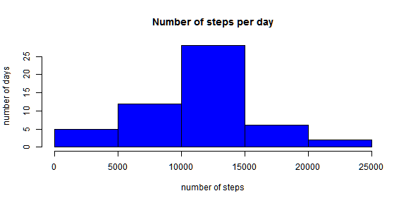
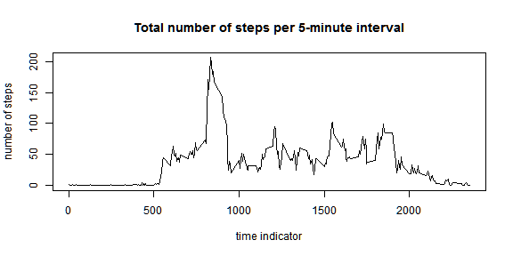
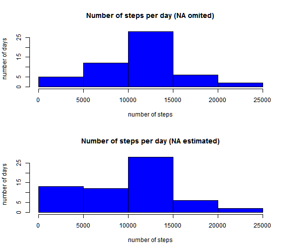
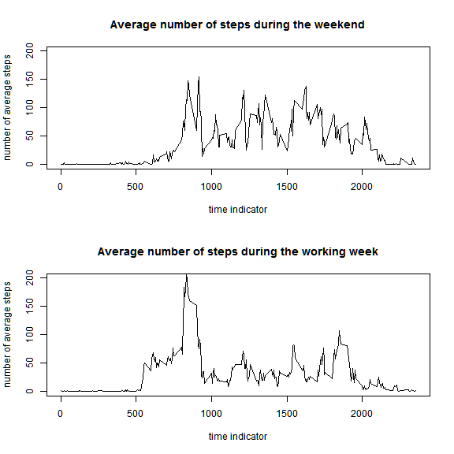

Reproducible Research - Assingment 1
========================================================
This assignment makes use of data from a personal activity monitoring device. This device collects data at 5 minute intervals through out the day. The data consists of two months of data from an anonymous individual collected during the months of October and November, 2012 and include the number of steps taken in 5 minute intervals each day.

The data used was downloaded from [here](https://d396qusza40orc.cloudfront.net/repdata%2Fdata%2Factivity.zip).

# Loading and preparing the data
We read the data into R:

```r
destfile <- "activity.zip"
filein <- "activity.zip"
fileout <- "activity.csv"
unzip(filein, fileout)
data <- read.csv(unzip(filein, fileout), header = TRUE, sep = ",", stringsAsFactors = FALSE)
```


The variables included in this dataset are:

- **steps**: Number of steps taking in a 5-minute interval (missing values are coded as NA)
- **date**: The date on which the measurement was taken in YYYY-MM-DD format
- **interval**: Identifier for the 5-minute interval in which measurement was taken

Now let's have closer look at the data:


```r
head(data)
```

```
##   steps       date interval
## 1    NA 2012-10-01        0
## 2    NA 2012-10-01        5
## 3    NA 2012-10-01       10
## 4    NA 2012-10-01       15
## 5    NA 2012-10-01       20
## 6    NA 2012-10-01       25
```

```r
str(data)
```

```
## 'data.frame':	17568 obs. of  3 variables:
##  $ steps   : int  NA NA NA NA NA NA NA NA NA NA ...
##  $ date    : chr  "2012-10-01" "2012-10-01" "2012-10-01" "2012-10-01" ...
##  $ interval: int  0 5 10 15 20 25 30 35 40 45 ...
```

```r
summary(data)
```

```
##      steps           date              interval   
##  Min.   :  0.0   Length:17568       Min.   :   0  
##  1st Qu.:  0.0   Class :character   1st Qu.: 589  
##  Median :  0.0   Mode  :character   Median :1178  
##  Mean   : 37.4                      Mean   :1178  
##  3rd Qu.: 12.0                      3rd Qu.:1766  
##  Max.   :806.0                      Max.   :2355  
##  NA's   :2304
```


Not let's format the date variable into the proper date format.

```r
data$date <- strptime(data$date, "%Y-%m-%d")
```

Now we are ready to explore the data set.

# What is mean total number of steps taken per day?
To produce a histogram of the total number of steps each day, we have to aggregate the data.
In a first step we ignore all missing data.


```r
agdata <- aggregate(steps ~ as.character(date), data = data, sum)
```


Now we can produce the histogram.

```r
par(mfrow = c(1, 1))
hist(agdata$steps, main = "Number of steps per day", ylab = "number of days", 
    xlab = "number of steps", col = "blue")
```

 


To get some additional information about the number of daily steps we look at the mean and medium of the total number of steps per day.


```r
m1 <- round(mean(agdata$steps), 0)
m2 <- round(median(agdata$steps), 0)
```

The mean is 1.0766 &times; 10<sup>4</sup> the median 1.0765 &times; 10<sup>4</sup>.

# What is the average daily activity pattern?
To answer this question we will produce a plot of the average number of steps taken per five minutes against time.


```r
agdata.max <- aggregate(steps ~ interval, data = data, mean)
plot(agdata.max$interval, agdata.max$steps, type = "l", main = "Total number of steps per 5-minute interval", 
    ylab = "number of steps", xlab = "time indicator")
```

 

The person obviously had a peak in activity around 9 o'clock in the morning. Not let us see when exactly the person made the most steps.

And we calculate in which five minute intervall across all the days in the dataset the subject made the maximum number of known steps.

```r
max <- round(agdata.max[which.max(agdata.max$steps), ], 0)
```

The time interval with the maximum of steps is the interval with the time indicator 835 (08:35) with 206 steps.

# Imputing missing values
For some intervals data is missing.

```r
missing <- sum(is.na(data))
table(is.na(data$steps))
```

```
## 
## FALSE  TRUE 
## 15264  2304
```

So there are 2304 missing values in the dataset, all occur in the step variable.
The presence of missing data could introduce some bias into our calculations or summaries of the data.

A closer inspection shows that the missing data are evenly distributed (for readability the results are not printed here.)


```r
table(complete.cases(data$steps), data$interval)
```

To see what influence the missing data could have, we replace the missing values by the median of the corresponding 5-minute intervals and build a new dataset for further exploration.

```r
agdata.median <- aggregate(steps ~ interval, data = data, median)
data2 <- data
for (i in 1:dim(data)[1]) {
    if (is.na(data$steps[i])) {
        data2$steps[i] <- agdata.median[(agdata.median[1] == data$interval[i]), 
            2]
    }
}

head(data2)
```

```
##   steps       date interval
## 1     0 2012-10-01        0
## 2     0 2012-10-01        5
## 3     0 2012-10-01       10
## 4     0 2012-10-01       15
## 5     0 2012-10-01       20
## 6     0 2012-10-01       25
```


Know we can look at our "new" data and compare it to the original one.


```r
par(mfrow = c(1, 2))
agdata2 <- aggregate(steps ~ as.character(date), data = data2, sum)
par(mfrow = c(2, 1))
hist(agdata$steps, main = "Number of steps per day (NA omited)", ylab = "number of days", 
    xlab = "number of steps", col = "blue")
hist(agdata2$steps, main = "Number of steps per day (NA estimated)", ylab = "number of days", 
    xlab = "number of steps", col = "blue")
```

 

Now let's have a look at the mean and the median. Values in () are the values from the original data set. 

```r
m1n <- round(mean(agdata2$steps), 0)
m2n <- round(median(agdata2$steps), 0)
```

The mean has changed to 9504 (1.0766 &times; 10<sup>4</sup>) and the median to 1.0395 &times; 10<sup>4</sup> (1.0765 &times; 10<sup>4</sup>).
So both statistics are a bit lower with the "complete" dataset compared to the original one.

# Are there differences in activity patterns between weekdays and weekends?
First we generate a factor variable for different type of days and we aggregate our data over the time intervals to get the mean for each interval. Then we build two subset one for the weekend and one for weekdays.


```r
data2$weekday <- weekdays(data2$date)
# agdata2 <- aggregate(steps ~ interval, data = data2, mean)
data2$day <- "weekday"
for (i in 1:dim(data2)[1]) {
    if (data2$weekday[i] %in% c("Samstag", "Sonntag")) {
        # You may need English names here.
        data2$day[i] <- "weekend"
    }
}
data2.weekday <- subset(data2, data2$day == "weekday")
agdata.weekday <- aggregate(steps ~ interval, data = data2.weekday, mean)
data2.weekend <- subset(data2, data2$day == "weekend")
agdata.weekend <- aggregate(steps ~ interval, data = data2.weekend, mean)
```

Now we can use the calculated values to produce a graphical representation:


```r
par(mfrow = c(2, 1))
plot(agdata.weekend$interval, agdata.weekend$steps, type = "l", main = "Average number of steps during the weekend", 
    ylab = "number of average steps", xlab = "time indicator", ylim = c(0, 200))
plot(agdata.weekday$interval, agdata.weekday$steps, type = "l", main = "Average number of steps during the working week", 
    ylab = "number of average steps", xlab = "time indicator", ylim = c(0, 200))
```

 

As we can see from the graph the pattern at the weekend looks slightly different from the one during the working days.


